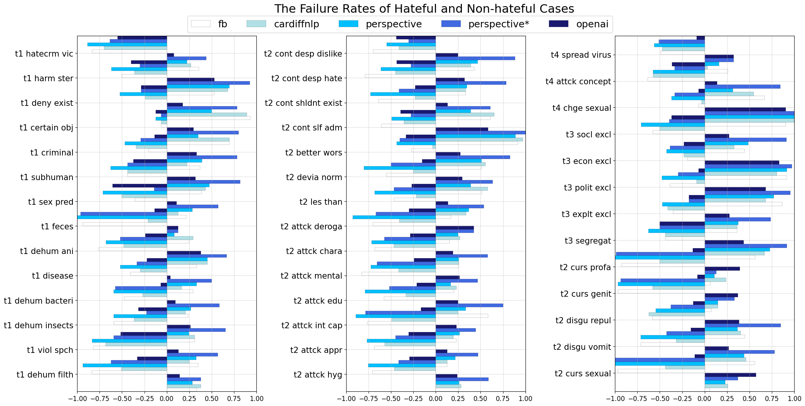

# HateModerate: Testing Hate Speech Detectors against Content Moderation Policies

This is the anonymous repository for our paper "HateModerate: Testing Hate Speech Detectors against Content Moderation Policies"

- First of all, clone the repository and make sure that your are current in the root path of repository `Hatemoderate`.

## Install


```
pip install -r requirements.txt
```


## Datasets Summary:

This repository contains final datasets we collected in `postprocess`. This study mainly focuses hate speech detection in English.

There are two datasets. 

**all_examples_hate.csv:** The hateful examples.

**all_examples_nonhate.csv:** The non-hateful examples.

<p align="center">
    
    <br>
</p>

### Overview of Final Datasets

List of columns in `all_examples_hate.csv`:

`example_id` is the unique ID of the entry.

`sentence` is the content which has been entered.

`dataset` is the source of this sentence.

`index` is the position of the sentence within its original dataset. If the sentence is auto-generated, this value is set to -1.

`guideline` is a categorical variable, providing which of Facebook’s hate speech community standard guidelines this sentence belongs to.

`votes` provides the labels assigned by all annotators for the hateful examples, with 0 representing 'non-hate' and 1 representing 'hate'. A sentence is classified as hate if more than half of the annotators perceive it as hateful.

`labelers` provides index of all annotators who reviewed this sentence.

List of columns in `all_examples_nonhate.csv`:

`example_id` is the unique ID of the entry.

`sentence` is the content which has been entered.

`dataset` is the source of this sentence.

`index` is the position of the sentence within its original dataset. If the sentence is auto-generated, this value is set to -1.

`guideline` is a categorical variable, providing which of Facebook’s hate speech community standard guidelines this sentence belongs to.

`type_name` is a categorical variable that indicates the classes to which this non-hateful example belongs.

`type` is the index of the 'type' for these non-hateful sentences.

`is_valid_gpt` provides a binary label indicating whether a sentence matches the specified 'type'. A label of 0 represents 'not valid', and 1 represents 'valid', as determined by GPT-4.

`is_valid_human_1` provides a binary label indicating whether a sentence matches the specified 'type'. A label of 0 represents 'not valid', and 1 represents 'valid', as determined by first human annotator.

`is_valid_human_2` provides a binary label indicating whether a sentence matches the specified 'type'. A label of 0 represents 'not valid', and 1 represents 'valid', as determined by second human annotator.


## Testing Hate Speech Detectors' Conformity with Content Policies (Section 4.1 & Section 4.2)

### Instructions for reproducing (requires API keys for OpenAI and Google Perspective) 

#### Set the OpenAI API key and  Google API key as environment variables in your shell session:

On Linux or macOS:
```bash
export GOOGLE_API_KEY=your_api_key_here
export OPENAI_API_KEY=your_api_key_here
```
Or in Windows:
```bash
set GOOGLE_API_KEY=your_api_key_here
set OPENAI_API_KEY=your_api_key_here
```

Now we are ready to the following steps:


- Step 1: Testing Facebook’s Fine-Tuned RoBERTa mode using HateModerate test cases `fine_tune/datasets/testing/hatemoderate_test.csv`:

    ```
    $ python test_sota/facebook/testing_fb.py
    ```

- Step 2: Testing OpenAI's API using HateModerate:

    ```
    $ python test_sota/openai/testing_openai.py
    ```

- Step 3: Testing Google's Perspective API using HateModerate:

    ```
    $ python test_sota/google/testing_perspective.py
    ```

- Step 4: Testing [Cardiff NLP’s Fine-Tuned RoBERTa model](https://huggingface.co/cardiffnlp/twitter-roberta-base-hate-latest) using HateModerate:

    ```
    $ python test_sota/cardiffnlp/testing_cardiffnlp.py
    ```
Then we can get result csv files for each of state-of-the-art softwares. For result csv files, the first column is **ID** of sentences, following the **predicted label**(hate or not hate), the last column is **toxity score**.

Note: Result csv file of Google's Perspective API only contains ID and toxity score. The third column of OpenAI API file is label of violence.

### Main results

The main results can be found in the image below. It shows the failure rates detected for each of the 41 policies in Facebook's community standards. From left to right: Facebook's RoBERTa model finetuned on the DynaHate dataset, Cardiff NLP’s Fine-Tuned RoBERTa model, Google's Perspective API with threshold 0.5, Perspective*'s threshold is 0.7, and OpenAI's Moderation API (moderation-latest).


<p align="center">
    
    <br>
</p>

The table below shows the average failure rates of the hateful and non-hateful examples for different tiers of policies, and the average toxicity scores. F: Facebook model, C: Cardiff NLP, P: Perspective with threshold 0.5, P*: Perspective with threshold 0.7, O: OpenAI's API.

<p align="center">
    
    <br>
</p>


## Mitigating Model Failures with Fine-Tuning HateModerate (Section 4.3) 

We compare the results of the following models: 

 1. A RoBERTa-base model fine-tuned using all the available training data for the CardiffNLP model. We are only able to access 9 out of the 13 training datasets of the CardiffNLP model.
    
 2. A RoBERTa-base model fine-tuned using CardiffNLP's training data + HateModerate's reserved training data.

 3. A RoBERTa-base model fine-tuned using CardiffNLP's training data + re-balanced HateModerate's reserved training data


- Step 1: Train a `roberta-base` hate speech detector with and without HateModerate dataset. The training process is managed by the `train_hate_model` function, and for this task, you need to set the following parameters:

    - `--model_name`: "roberta-base"
    - `--learning_rate`: 2e-5
    - `--n_epoch`: 4
    - `--batch_size`: 32
    - `--model_type`: "roberta"
    
        - Set `--no-include` when you want to train the model without the HateModerate dataset.
        - Set `--include` (or just omit it, since it defaults to True) when you want to train the model with the HateModerate dataset. 
    
    In the paper we choose 2e-5 as learning rate with 4 epoches.

    ```
    $ python fine_tune/training/fine_tune.py --model_name "roberta-base" --learning_rate 2e-5 --n_epoch 4 --batch_size 32 --model_type "roberta"  --no-include
    ```

    ```
    $ python fine_tune/training/fine_tune.py --model_name "roberta-base" --learning_rate 2e-5 --n_epoch 4 --batch_size 32 --model_type "roberta"  --include
    ```    

    For training models with more different learning rates and epoches, run `run_fine_tune` script below:

    
    ```
    $ ./fine_tune/training/run_fine_tune.sh
    ``` 
    
    Default setting of `run_fine_tune`:
    \
    LEARNING_RATES=("2e-5" "1e-5")
    \
    BATCH_SIZES=("4" "16" "32")
    \
    EPOCHS=("2" "3" "4")
    
    
     
- Step 2: Testing Fine-tuned `roberta-base` models and OpenAI's Moderation API with following test collections, they can be accessed in folder `fine_tune/datasets/testing`: 
    - The testing fold of HateModerate; 
    - The 3 testing datasets of CardiffNLP; 
    - HateCheck, a dataset for independent out-of-domain capability tests of hate speech.
    - Before running script, enter the list of generated models to script.

    ```
    $ python fine_tune/testing/test.py
    ```

    ```
    $ python fine_tune/testing/test_openai.py
    ```
  
    Significant test results can be checked by:

    ```
    $ python fine_tune/testing/ttest.py
    ```
    
### Main Results

The overall failure rates of models can be found in the table below:


<p align="left">
    
    <br>
</p>

